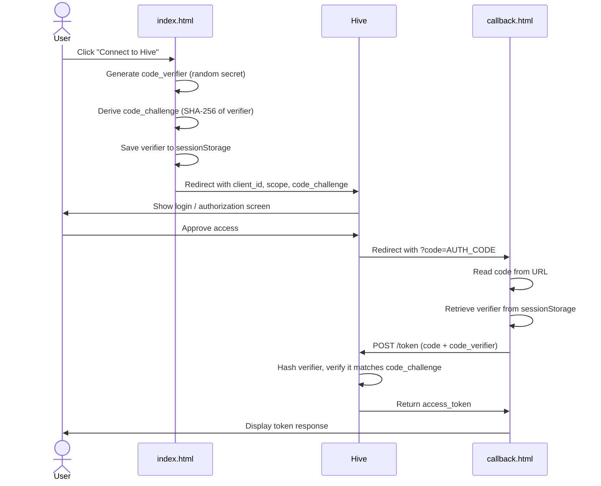

# hive-oauth-example

A minimal reference implementation of the **Hive API v2 OAuth 2.0 Authorization Code Flow with PKCE** for partner developers.

## Files

| File            | Purpose                                                                            |
| --------------- | ---------------------------------------------------------------------------------- |
| `index.html`    | Start page — click a button to begin the OAuth flow                                |
| `callback.html` | Callback page — exchanges the authorization code for a token and prints the result |
| `pkce.js`       | PKCE helpers: generates the code verifier and SHA-256 challenge                    |
| `oauth.js`      | OAuth flow logic: builds the authorization URL and handles the token exchange      |

No build step. No dependencies. Uses only browser-native Web Crypto API.

## Running locally

Serve the files from a local HTTP server (required — `file://` URLs don't work with redirects or ES modules).

```bash
# Python
python -m http.server 9123

# Node
npx serve .
```

Then open http://localhost:9123.

## Configuration

Edit the `CONFIG` block at the top of `oauth.js`, adding your application's client ID and client secret:

```js
const CONFIG = {
  clientId: "YOUR_CLIENT_ID",
  clientSecret: "YOUR_CLIENT_SECRET",
  ...
};
```

## How it works


