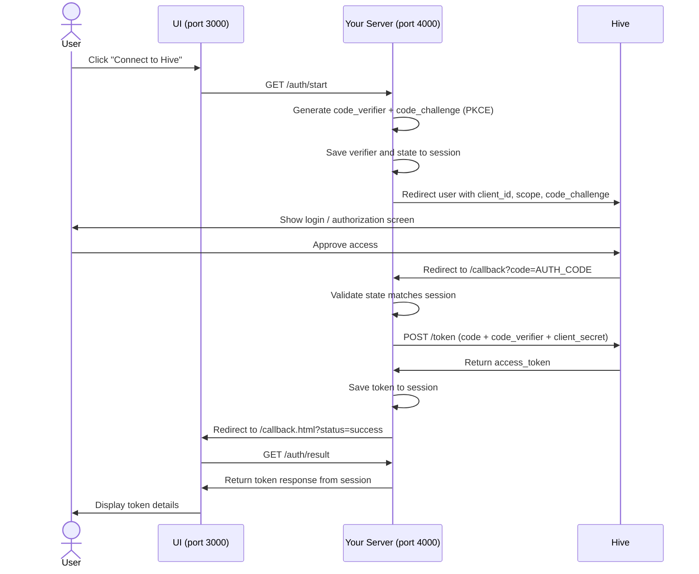

# hive-oauth-example

Reference implementations of the **Hive API v2 OAuth 2.0 Authorization Code Flow with PKCE**.

## Available examples

- [`examples/python`](examples/python) — Flask server + static HTML UI
- [`examples/node`](examples/node) — Express server + static HTML UI

## How it works

The flow involves two servers: your backend (port 4000) and a simple static file server for the UI (port 3000). The browser only ever talks to your backend — the `client_secret` and token response never touch the browser directly.

## Why a server?

The token exchange requires a `client_secret` which must never be exposed in client-side code. The server handles the exchange and stores the token in a session — the browser only receives a success/error status via the redirect URL.
